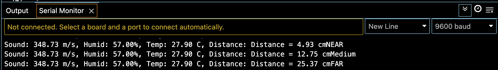
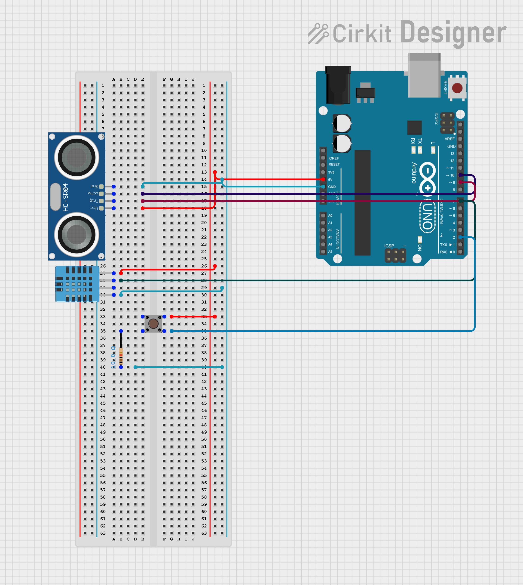

# Gesture-Controlled Combination Lock (Arduino)

Unlock a lock using hand gestures detected by an ultrasonic sensor.

## Features
- **Ultrasonic sensor (HC-SR04):** detects near / medium / far hand gestures.
- **RGB LED:** shows lock status (red = locked, yellow = waiting, green = unlocked).
- **Buzzer:** gives audio feedback (beeps, error tones).
- **Servo motor:** acts as the lock (rotates when unlocked).
- **Reset system:** resets automatically on wrong input or timeout.

## Hardware
- Arduino UNO
- HC-SR04 ultrasonic sensor
- RGB LED + resistors
- Passive buzzer
- Servo motor
- Jumper wires, breadboard

## Milestones
1. Ultrasonic Distance Reading & Distance Category Detection & Button
3. Record and compare gesture sequences.
4. Add LED and buzzer feedback.
5. Servo lock mechanism.
6. Reset & polish.

## Milestone 1

Using HC-SR04 distance sensor, I calculate the distance from an object to the sensor. Furthermore, to increase accuracy, I used the DHT-11 temperature and humidity sensor to measure the surrounding evironment's conditions. Using the data of temperature and humidity, I recalculated the speed of sound (given the not necessarily ideal conditions). Additionally, also in an attempt to increase accuracy, I added iterations that the HC-SR04 sensor calculates average duration from a given object. I did this to stabilize output readings of the duration. I used three libraries: DHT Library, AdaFruit_Sensors Library and NewPring Library.

## Repo Structure
Gesture Lock/
— GestureLock.ino #  main Arduino sketch
— README.md # this file
— .gitignore # ignore build artifacts
— docs/ # wiring diagrams, flowcharts
— media/ #photos or demo videos

## License
MIT
